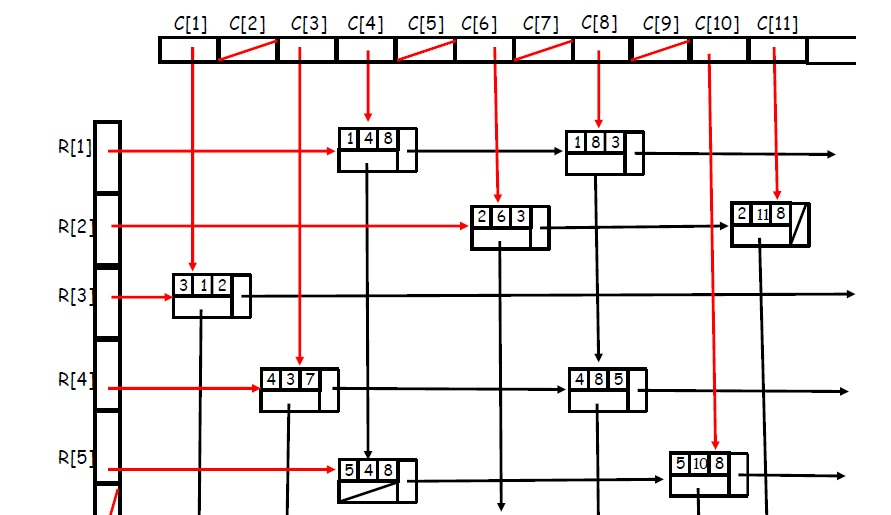

# SM-using-LL
An implementation of a Sparse Matrix class using Linked List for CSC 212's final project
Our representation included implementing a Sparse MAtrix by Lists of Linked Lists
Each node looks like:
| int row  | Node* next in row --> |
|----------|-----------------------|
| int col  | Node* next in col  v  |
| int data |                       |

While the Matrix class holds two array of Node* that hold the first of the next node in col and the other holding the first of node next in row (poor explanation but picture below shows how it should look):


### To compile/run
```g++ main.cpp Matrix.cpp Node.cpp -o run``` 

- Make sure to have <strong>git</strong> installed and copy this command in git console ```git clone https://github.com/iperalta7/SM-using-LL.git```
- To run: ```./run.exe <name of file 1> <row> <col> <name of file 2> <row> <col>``` (make sure to be in the repo dir in the console)
- row is the number of rows for the matrix in file 1 and col is the number of columns for the matrix in file 2. (Use the .txt files included)
- A CMake configuration can be used to easily run by changing the console commands if you are using CLION. 
